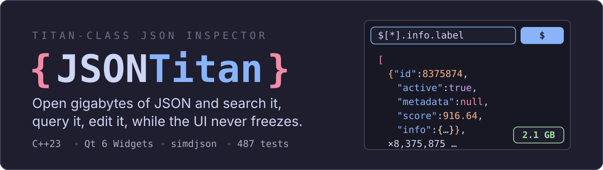
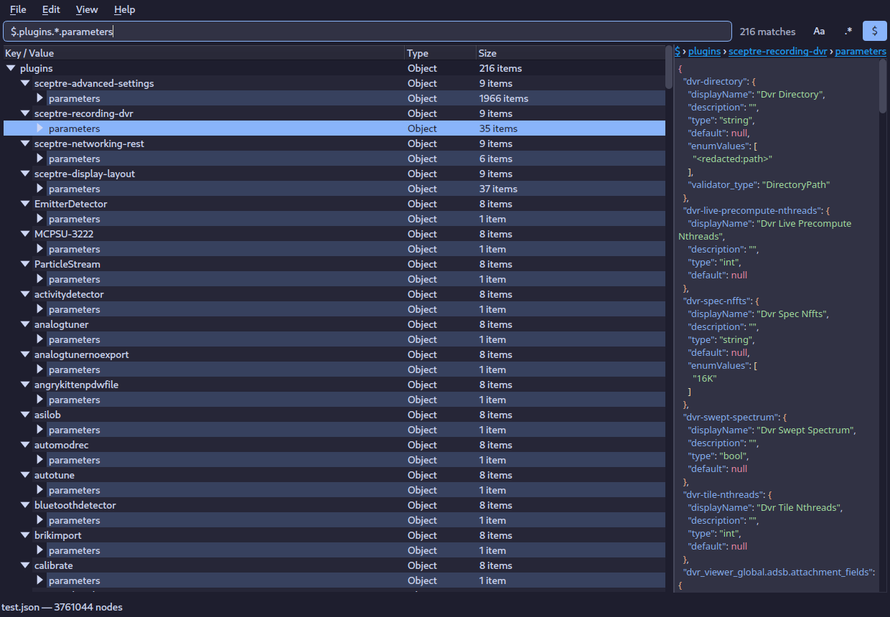
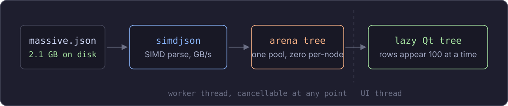
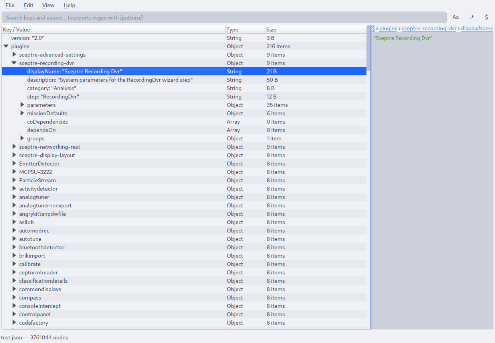

<p align="center">
  
</p>

<p align="center">
  
</p>
<p align="center"><sub>
  A real session: a 137&nbsp;MB / 3.76&nbsp;million-node document, filtered live by the
  JSONPath query <code>$.plugins.*.parameters</code> 216 matches, highlighted and
  navigable with <kbd>F3</kbd>.
</sub></p>

JSONTitan is a Qt 6 desktop app for the JSON files that break other tools.
It opens multi-gigabyte documents into a lazy tree you can search, query with
JSONPath, edit with undo, and export, while parsing happens on a worker thread
you can cancel at any moment.

## Why it stays responsive

<p align="center">
  
</p>

- **simdjson** parses at SIMD speed on a background thread; progress is live and cancellation takes effect mid-parse.
- Nodes land in a single **memory arena** no per-node heap allocations, and the raw file bytes are released the moment parsing ends.
- The tree view is **lazy**: rows materialize 100 at a time as you expand and scroll, so a 3.7-million-node document opens instantly.
- Viewing, saving, and exporting stream **directly from the arena** nothing is ever deep-copied just to display it.

Verified against this repository's own 2.1 GB, 8.4-million-record test document.

## What you can do

| | |
|---|---|
| **Search three ways** | Substring, regex, or a JSONPath subset (`$.store.book[*].author`, `..`, `[n]`, wildcards) with match count, <kbd>F3</kbd>/<kbd>Shift+F3</kbd> navigation, and highlighted results |
| **Edit safely** | Inline value editing (<kbd>F2</kbd>), key rename with duplicate detection, node deletion all undoable (<kbd>Ctrl+Z</kbd>), all saved atomically so a failed write never destroys your file |
| **Combine files** | Union multiple documents into one tree, parsed in the background; remove sources again at any time |
| **Export anything** | Whole document or any subtree as JSON, CSV (injection-safe), or XML streamed to disk, never built in memory |
| **Stay oriented** | Breadcrumb path bar, copy key/value/JSONPath to clipboard, type & size columns, expand-to-level controls |
| **Trust the app** | External-change watcher with reload prompt, session restore, unsaved-changes guards everywhere |

Light and dark themes follow the app's Catppuccin palette and persist across sessions:

| Dark (Mocha) | Light (Latte) |
|---|---|
|  |  |

## Build and run

Requires a C++23 compiler, CMake ≥ 3.16, and Qt 6 (`Core`, `Gui`, `Widgets`). simdjson is fetched automatically.

```bash
git clone https://github.com/yourusername/JSONTitan.git
cd JSONTitan
cmake -B build && cmake --build build -j
./build/src/shell/jsontitan_shell your-huge-file.json
```

Run the test suite (487 tests: GoogleTest, RapidCheck property tests, Qt Test):

```bash
ctest --test-dir build
```

## Keyboard reference

| Shortcut | Action | Shortcut | Action |
|---|---|---|---|
| <kbd>Ctrl+O</kbd> | Open | <kbd>Ctrl+F</kbd> | Focus search |
| <kbd>Ctrl+S</kbd> | Save (atomic) | <kbd>F3</kbd> / <kbd>Shift+F3</kbd> | Next / previous match |
| <kbd>Ctrl+Z</kbd> / <kbd>Ctrl+Shift+Z</kbd> | Undo / redo | <kbd>F2</kbd> | Edit value inline |
| <kbd>Del</kbd> | Delete node | <kbd>F5</kbd> | Reload from disk |
| <kbd>Ctrl+Shift+E</kbd> / <kbd>C</kbd> | Expand / collapse all | <kbd>Esc</kbd> | Cancel a running load |

## Architecture

The codebase follows **functional core, imperative shell**:

- `src/core` pure C++, no Qt: parsing (simdjson adapter + a streaming reference parser used as a differential-test oracle), the arena allocator, search and JSONPath engines, immutable edit/delete engines with structural sharing (which is what makes undo nearly free), and streaming exporters.
- `src/shell` Qt 6: a lazy `QAbstractItemModel` over either tree backing, worker-thread loaders with request-generation cancellation, and focused controllers (document session, search, edit, union) around a thin main window.

Everything in the core is exercised by property-based tests; the shell is tested headlessly with Qt Test.

## Limits worth knowing

- Peak memory **during** parsing is a multiple of file size (input + simdjson DOM + arena coexist briefly). Steady-state drops to the arena alone once loading finishes.
- The JSONPath engine covers the navigation subset filter expressions like `[?(@.price < 10)]` are intentionally not supported (yet) and say so explicitly.
- Nesting is capped at 1,024 levels (matching simdjson) so hostile inputs fail with an error instead of a stack overflow.

## Contributing

Issues and pull requests are welcome. Fork, branch, make the tests pass (`ctest --test-dir build`), and open a PR.

## License

MIT.
